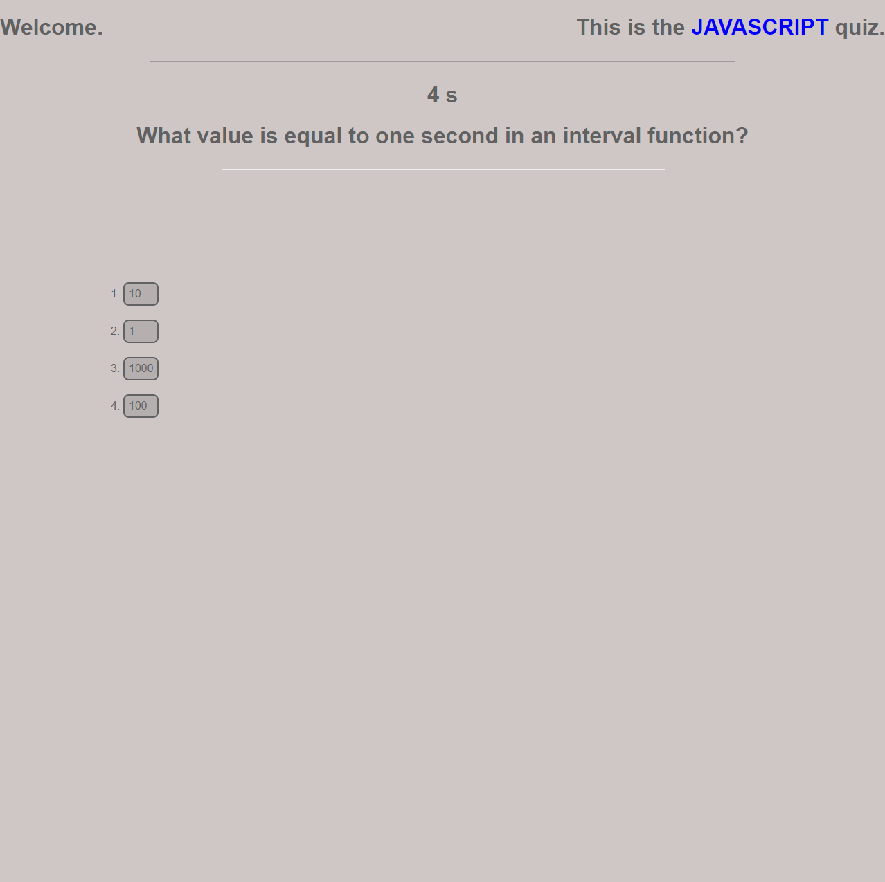

# Javascript Quiz
This repository holds the code for my Javascript Quiz application. 

## Description
This application will prompt the user to start the quiz, then ask a question. The quiz is timed.

## Usage

Click "Start Quiz" to begin the application. You will be shown a Javascript related question. You may click the answer choices below to decrement the timeleft on the timer. 

The password generator can be accessed via GitHub Pages [HERE](https://hdavis147.github.io/Javascript-Quiz/).

## Credits

All code written by me.

## License

[MIT License](./LICENSE)
